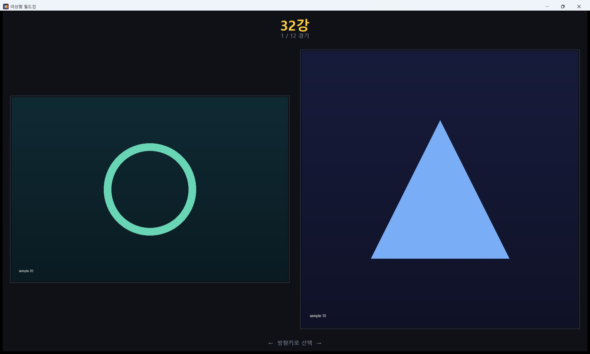
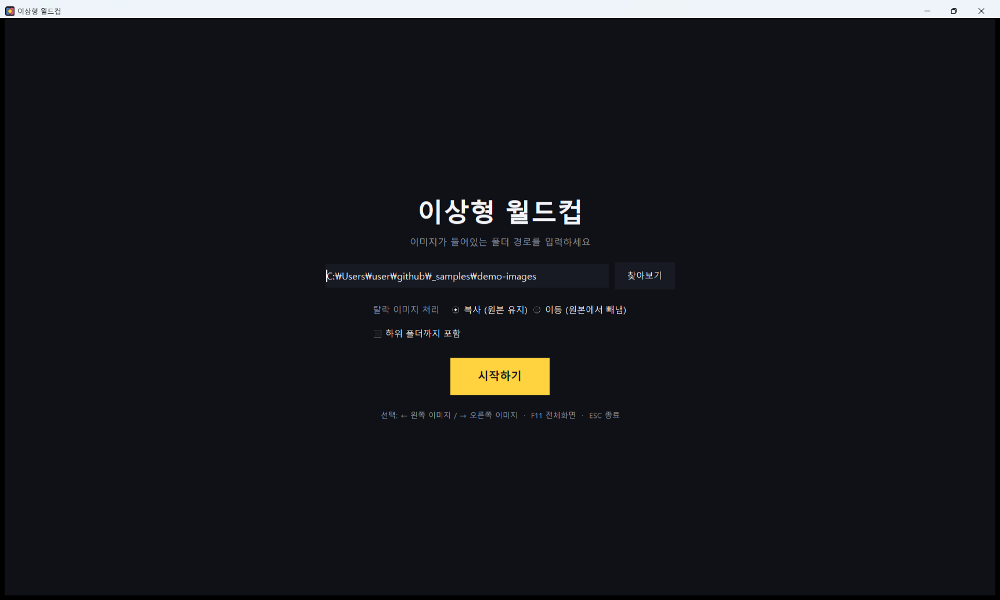

# 이상형 월드컵

폴더 내 이미지로 토너먼트를 진행해 최종 1장을 고르는 도구입니다.
화면 양쪽에 표시된 두 이미지 중 하나를 방향키로 선택하면, 탈락한 이미지는 해당 라운드 이름의 폴더로 분류됩니다.

> Tournament-style image picker. Point it at a folder, compare two images at a time with the arrow
> keys, and it files every loser into a folder named after the round it lost in — 32강, 16강, …,
> 결승, 우승. Copy mode by default, so the originals stay untouched. tkinter + Pillow.



## 사용 사례

한 장만 남겨야 하지만 후보가 많아 고르기 어려울 때 유용합니다. 전체 순위를 매기기는 까다로워도 둘 중 하나를 고르는 것은 쉽다는 점을 활용했습니다.

- **레퍼런스·시안 압축** — 수십 장의 후보 중 최종 1장을 골라야 할 때
- **썸네일 후보 비교** — 두 시안을 1:1로 비교하며 시인성을 확인할 때
- **사진 선별** — 유사한 구도의 사진 중 베스트 컷 1장을 남길 때

토너먼트가 끝나면 진출 라운드별로 폴더가 자동 정리되므로, 후반까지 경쟁했던 후보와 초반 탈락 후보를 쉽게 구분할 수 있습니다.

## 주요 기능

- 후보 수에 맞춘 라운드 자동 구성 (32강 → 16강 → … → 결승, 홀수일 경우 1장 무작위 부전승)
- 라운드마다 대진 무작위 재배치
- **좌/우 방향키 선택** — 선택된 이미지는 화면 중앙에서 확대되어 2초간 표시
- **복사 모드 기본 적용** — 원본 폴더를 유지한 채 `_결과` 폴더로 복사 (이동 모드로 변경 가능)
- 중복 파일명 자동 처리 (`이름_1.jpg` 형식으로 변경하여 덮어쓰기 방지)
- 단축키 지원 (`F11` 전체화면, `ESC` 종료)



## 실행 방법

```bash
pip install pillow
python worldcup.py
```

Windows 환경에서는 `run.bat` 파일을 더블클릭해 실행할 수도 있습니다.
이미지가 담긴 폴더 경로를 지정한 뒤 **시작하기**를 누르면 진행됩니다.

## 결과 폴더 구조

선택이 완료되면 원본 폴더 내에 아래와 같이 정리됩니다.

```
이미지폴더/
└─ _결과/
   ├─ 32강/     ← 1라운드 탈락
   ├─ 16강/
   ├─ 8강/
   ├─ 4강/
   ├─ 결승/     ← 준우승
   └─ 우승/     ← 최종 1장
```

지원 형식: jpg, jpeg, jfif, png, gif, bmp, webp, tif, tiff

## 라이선스

MIT
